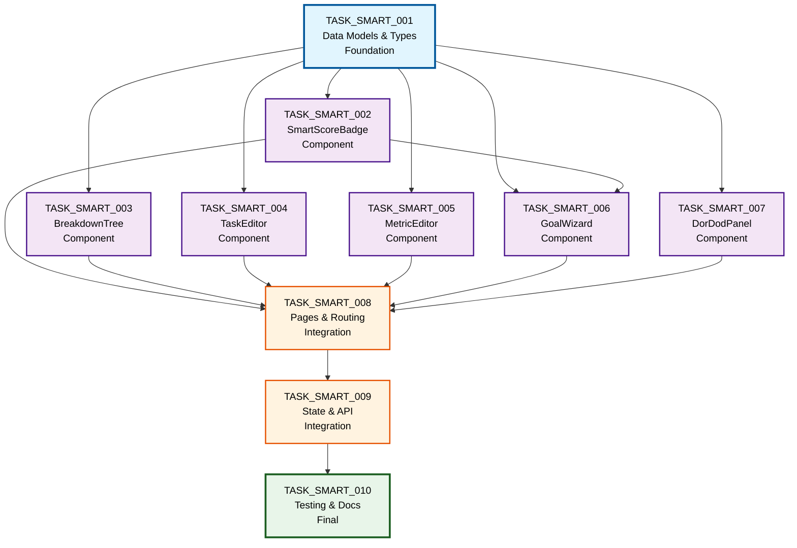

# SMART Goals Tasks Dependency Graph

## Overview
This document visualizes the dependencies between all SMART Goals implementation tasks.

## Dependency Matrix

| Task | Depends On | Required By |
|------|------------|-------------|
| TASK_SMART_001 | None (Foundation) | 002, 003, 004, 005, 006, 007 |
| TASK_SMART_002 | 001 | 006 |
| TASK_SMART_003 | 001 | 008 |
| TASK_SMART_004 | 001 | 008 |
| TASK_SMART_005 | 001 | 006, 008 |
| TASK_SMART_006 | 001, 002 | 008 |
| TASK_SMART_007 | 001 | 008 |
| TASK_SMART_008 | 001-007 | 009 |
| TASK_SMART_009 | 001-008 | 010 |
| TASK_SMART_010 | 001-009 | None (Final) |

## Mermaid Dependency Graph



## Implementation Phases

### Phase 1: Foundation (1 task)
- **TASK_SMART_001**: Data Models & Type Definitions
  - No dependencies
  - Required by all component tasks
  - Must be completed first

### Phase 2: Core Components (5 tasks - can be parallel)
Can be worked on in parallel after Task 001:
- **TASK_SMART_002**: SmartScoreBadge Component
- **TASK_SMART_003**: BreakdownTree Component
- **TASK_SMART_004**: TaskEditor Component
- **TASK_SMART_005**: MetricEditor Component
- **TASK_SMART_007**: DorDodPanel Component

### Phase 3: Composite Component (1 task)
Requires completion of Tasks 001 and 002:
- **TASK_SMART_006**: GoalWizard Component
  - Depends on SmartScoreBadge for score display
  - Integrates MetricEditor in measurable step

### Phase 4: Integration (2 tasks - sequential)
- **TASK_SMART_008**: Goal Pages & Routing
  - Requires ALL components (001-007)
  - Integrates everything into pages

- **TASK_SMART_009**: State Management & API
  - Requires pages and routing (008)
  - Connects everything with state

### Phase 5: Finalization (1 task)
- **TASK_SMART_010**: Testing, Documentation & Final Integration
  - Requires everything (001-009)
  - Final verification and polish

## Critical Path

The critical path (longest dependency chain) is:
```
001 → 002 → 006 → 008 → 009 → 010
```
Or alternatively:
```
001 → (003/004/005/007) → 008 → 009 → 010
```

## Parallel Work Opportunities

### Maximum Parallelization Strategy:
1. **Step 1**: Complete Task 001 (Foundation)
2. **Step 2**: Work on Tasks 002, 003, 004, 005, 007 in parallel (5 developers)
3. **Step 3**: Complete Task 006 (requires 002)
4. **Step 4**: Complete Task 008 (requires all components)
5. **Step 5**: Complete Task 009 (requires 008)
6. **Step 6**: Complete Task 010 (final integration)

### Minimum Team Strategy (1-2 developers):
1. Complete Tasks 001 → 002 → 006 (wizard path)
2. Complete Tasks 003, 004, 005, 007 (other components)
3. Complete Tasks 008 → 009 → 010 (integration)

## Risk Mitigation

### High-Risk Dependencies:
1. **Task 001** - All other tasks depend on this
   - Mitigation: Complete first, review thoroughly

2. **Task 008** - Integrates all components
   - Mitigation: Start integration testing early

3. **Task 009** - State management affects everything
   - Mitigation: Design state structure carefully

### Low-Risk Parallel Tasks:
- Tasks 003, 004, 005, 007 can be developed independently
- Each has isolated functionality
- Can be tested in Storybook independently

## Recommended Implementation Order

### For Single Developer:
1. TASK_SMART_001 (Foundation)
2. TASK_SMART_002 (SmartScoreBadge)
3. TASK_SMART_006 (GoalWizard)
4. TASK_SMART_003 (BreakdownTree)
5. TASK_SMART_004 (TaskEditor)
6. TASK_SMART_005 (MetricEditor)
7. TASK_SMART_007 (DorDodPanel)
8. TASK_SMART_008 (Pages & Routing)
9. TASK_SMART_009 (State & API)
10. TASK_SMART_010 (Testing & Documentation)

### For Team of 2-3 Developers:

**Developer 1 (Wizard Path):**
1. TASK_SMART_001 (shared)
2. TASK_SMART_002
3. TASK_SMART_006
4. TASK_SMART_008 (collaborate)

**Developer 2 (Components Path):**
1. TASK_SMART_001 (shared)
2. TASK_SMART_003
3. TASK_SMART_004
4. TASK_SMART_005
5. TASK_SMART_008 (collaborate)

**Developer 3 (Support & Integration):**
1. TASK_SMART_007
2. TASK_SMART_009
3. TASK_SMART_010

## Notes

- Tasks within the same phase can be worked on simultaneously
- Each task includes its own testing requirements
- Storybook stories allow independent component development
- Integration points (Task 008 & 009) require careful coordination
- Final task (010) ensures everything works together